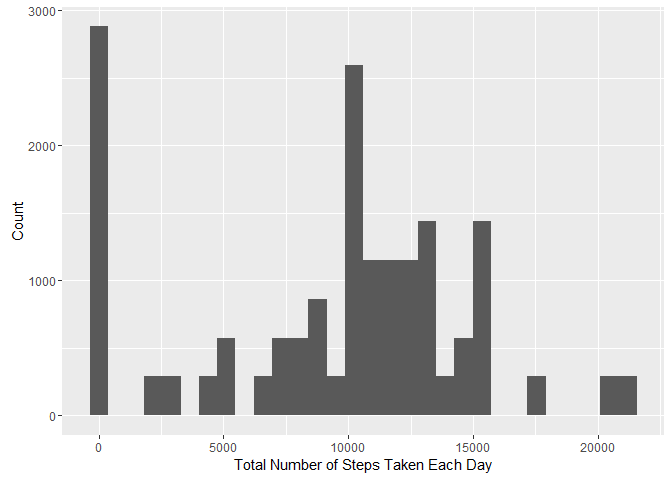
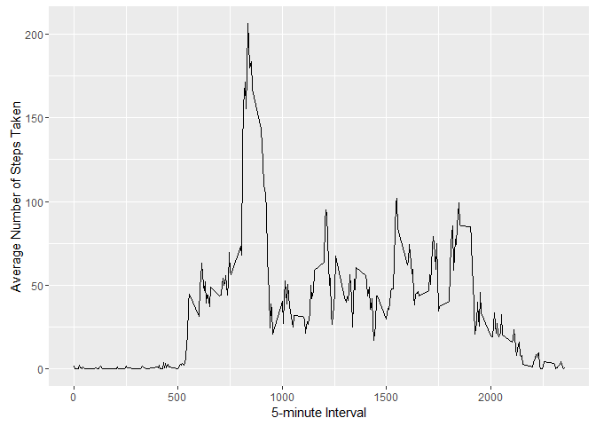
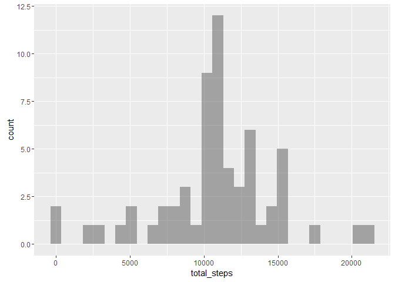
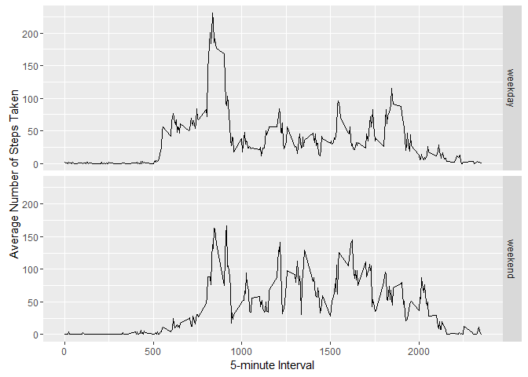

# Reproducible Research: Peer Assessment 1


##Loading and preprocessing the data
The libraries used in this assignment are first loaded.

```r
library(ggplot2)
library(dplyr)
```

The file activity.csv is read and loaded into the data frame pam.

```r
pam <- read.csv("activity.csv")
```

##What is mean total number of steps taken per day?
The histogram below shows the total number of steps taken each day, ignoring the missing values in the dataset. 

```r
pam_date <- group_by(pam, date)
pam_date_total_steps <- mutate(pam_date, total_steps = sum(steps, na.rm = TRUE))
g <- ggplot(data = pam_date_total_steps, aes(x = total_steps)) 
g + geom_histogram() + xlab("Total Number of Steps Taken Each Day") + ylab("Count")
```

<!-- -->

Then the mean and median for the total number of steps taken each day are calculated and reported.

```r
mean(pam_date_total_steps$total_steps)
```

```
## [1] 9354.23
```

```r
median(pam_date_total_steps$total_steps)
```

```
## [1] 10395
```

##What is the average daily activity pattern?
The following time series plot shows the 5-minute interval and the average number of steps taken, averaged across all days.

```r
pam_interval <- group_by(pam, interval)
pam_interval_mean_steps <- summarize(pam_interval, mean_steps = mean(steps, na.rm = TRUE))
g <- ggplot(data = pam_interval_mean_steps, aes(x = interval, y = mean_steps)) 
g + geom_line() + xlab("5-minute Interval") + ylab("Average Number of Steps Taken")
```

<!-- -->

Then the 5-minute interval containing the maximum number of steps on average across all the days is calculated.

```r
pam_interval_mean_steps[which.max(pam_interval_mean_steps$mean_steps),]
```

```
## Source: local data frame [1 x 2]
## 
##   interval mean_steps
##      (int)      (dbl)
## 1      835   206.1698
```

##Imputing missing values
The code below calculates the total number of missing values in the dataset.

```r
sum(is.na(pam$steps)) 
```

```
## [1] 2304
```

There is an important amount of missing values so a decision has been made to fill them in with the mean value for that interval.This is done by the code below. 

```r
fill_na_steps <- function(interval, step) {
    if (is.na(step)) 
        step_filled <- as.integer((pam_interval_mean_steps[pam_interval_mean_steps$interval == interval, "mean_steps"]))
    else
        step_filled <- step
    return(step_filled)
}
pam_filled <- pam
pam_filled$steps <- mapply(fill_na_steps, pam_filled$interval, pam_filled$steps)
```

The histogram below shows the total number of steps taken each day, with the missing values filled in.

```r
pam_filled_date <- group_by(pam_filled, date)
pam_filled_date_total_steps <- summarize(pam_filled_date, total_steps = sum(steps, na.rm = TRUE))
ggplot() + geom_histogram(data = pam_filled_date_total_steps,aes(x=total_steps),alpha=I(0.5))
```

<!-- -->

Then the mean and median total number of steps taken each day are calculated and reported.

```r
mean(pam_filled_date_total_steps$total_steps)
```

```
## [1] 10749.77
```

```r
median(pam_filled_date_total_steps$total_steps)
```

```
## [1] 10641
```

Both the mean and median values are higher than the ones calculated when ignoring the missing values. The reason is that the new filled in values will usually be greater than cero so that they will increase the values for the mean and the median. 

##Are there differences in activity patterns between weekdays and weekends?
A new column is created in the data frame indicating whether a given date is a weekday or weekend day.

```r
pam_filled$date <- as.Date(pam_filled$date)

add_weekday <- function(date) {
    day_type <- "weekday" 
    if (weekdays(date) %in% c("Saturday", "Sunday"))
        day_type <- "weekend"
    return(day_type)
}
pam_filled$day_type <- mapply(add_weekday, pam_filled$date)
pam_filled$day_type <- as.factor(pam_filled$day_type)
```

The next time series plot shows the 5-minute interval and the average number of steps taken, averaged across all weekday days or weekend days.

```r
pam_filled_interval <- group_by(pam_filled, interval, day_type)
pam_filled_interval_mean_steps <- mutate(pam_filled_interval, mean_steps = mean(steps))
g <- ggplot(data = pam_filled_interval_mean_steps, aes(x = interval, y = mean_steps)) 
g + geom_line() + facet_grid(day_type ~ .) + xlab("5-minute Interval") + ylab("Average Number of Steps Taken")
```

<!-- -->
